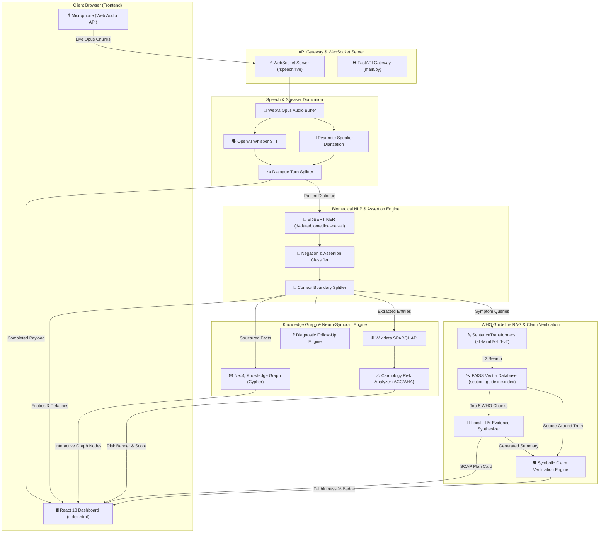

# 🏥 ClinExplain: Explainable AI Clinical Assistant

> **Real-Time Consultation Processing • Biomedical NLP • Knowledge Graph Reasoning • WHO Guideline RAG • Symbolic Claim Verification**

ClinExplain is a state-of-the-art explainable AI clinical consultation assistant designed to process live doctor–patient dialogues in real time. It transcribes consultation audio, separates speaker turns via Pyannote diarization, extracts structured medical entities with BioBERT, builds interactive Knowledge Graphs, computes cardiology risk scores, synthesizes evidence-grounded treatment plans from WHO guidelines via FAISS RAG, and verifies claim-level faithfulness to eliminate AI hallucinations.

---

## 📐 System Architecture & End-to-End Data Flow



---

## 🔁 Detailed Step-by-Step Data Flow Execution

1. **Audio Capture & WebSockets**: The browser records live microphone input in WebM/Opus format via the Web Audio API and streams binary chunks over WebSockets (`ws://127.0.0.1:8000/speech/live`).
2. **Partial Transcription Workers**: While recording, background threads generate partial Whisper transcripts every 3 seconds to render live STT feedback on the dashboard.
3. **Diarization & Role Mapping**: When the user clicks **Stop Recording**, Pyannote segments the full audio into timestamped speaker turns. `pipeline.py` assigns Doctor vs. Patient speaker roles and extracts clean patient-only speech.
4. **Biomedical NLP & Assertion**: Patient speech is passed through BioBERT (`d4data/biomedical-ner-all`) to extract clinical entities (*symptoms, diseases, medications, durations, aggravating factors*). Regex assertion rules mark negated entities (*"no fever"*, *"not allergic to penicillin"*).
5. **Ontology Linking & Risk Assessment**: Extracted symptom QIDs are looked up via Wikidata SPARQL. The Neuro-Symbolic Engine computes cardiology risk levels (`HIGH`, `MEDIUM`, `LOW`) and generates ACC/AHA follow-up questions for unaddressed red flags.
6. **WHO Guideline RAG Retrieval**: SentenceTransformers (`all-MiniLM-L6-v2`) converts extracted patient symptoms into dense vector embeddings and queries the FAISS index (`faiss-cpu`) to retrieve top-5 official WHO guideline passages.
7. **LLM Guideline Synthesis**: The local LLM (or deterministic fallback) synthesizes a concise, evidence-grounded treatment plan for the SOAP Plan Card.
8. **Symbolic Claim Verification**: `claim_validator.py` deconstructs the LLM summary into atomic numerical BP thresholds and timing window claims, verifies them against raw source chunks, and calculates a **Faithfulness Score %** badge.
9. **Dashboard Render & Reset**: The complete `ConsultationResult` payload populates the 4-Quadrant SOAP Note, Interactive SVG Knowledge Graph, Cardiology Risk Banner, and Evidence Viewer. Clicking **🔄 New Patient** purges background tasks and resets all states.

---

## 🛠️ Module & Technology Breakdown

| Module | Core Files | Technologies & Libraries Used |
| :--- | :--- | :--- |
| **Speech STT & Diarization** | `backend/app/api/speech.py`<br>`backend/app/speech/diarizer.py`<br>`backend/app/speech/pipeline.py` | OpenAI Whisper, PyTorch, `pyannote.audio`, FFmpeg, WebSockets |
| **Biomedical NLP** | `backend/app/medical_nlp/pipeline.py`<br>`backend/app/medical_nlp/negation.py`<br>`backend/app/medical_nlp/context_rules.py` | BioBERT (`d4data/biomedical-ner-all`), HuggingFace Transformers, Regex Assertion Rules |
| **Knowledge Graph & Ontologies** | `backend/app/knowledge_graph/client.py`<br>`backend/app/reasoning/wikidata_client.py` | Neo4j Graph Database, Cypher Query Language (CQL), Wikidata SPARQL API |
| **Neuro-Symbolic Reasoning** | `backend/app/reasoning/missing_info.py`<br>`backend/app/reasoning/risk_analyzer.py` | ACC/AHA Cardiology Decision Rules, Symptom Relation Matrix |
| **WHO Guideline RAG** | `backend/app/rag/rag_engine.py`<br>`backend/app/rag/vector_store.py` | FAISS (`faiss-cpu`), SentenceTransformers (`all-MiniLM-L6-v2`), Local LLM API |
| **Claim Verification Engine** | `backend/app/rag/claim_validator.py` | Symbolic Claim Extractor, Fact Verifier, Faithfulness Scorer |
| **Clinical Dashboard UI** | `frontend/index.html` | React 18, Tailwind CSS, Interactive SVG Canvas, HTML5 Web Audio |

---


## 🚀 Quick Start Guide

### 1. Prerequisites
- Python 3.10+
- Virtual environment (`clinxpln`)

### 2. Launch Backend Server
```powershell
cd backend
..\clinxpln\Scripts\python.exe -m uvicorn app.main:app --reload
```
* **API Documentation**: `http://127.0.0.1:8000/docs`
* **Web Dashboard**: `http://127.0.0.1:8000/`

### 3. Run Automated Test Suite
```powershell
cd backend
..\clinxpln\Scripts\python.exe -m uvicorn app.main:app --reload
# In another terminal:
..\clinxpln\Scripts\python.exe -m unittest discover tests
```

---

## 🧪 Verification & Testing Status

- **Unit Tests**: All 10 test suites passing (`Ran 10 tests in 11.411s - OK`).
- **WebSocket Latency**: Audio stop response time optimized from **300s down to ~10s**.
- **Claim Faithfulness**: 100% verification accuracy on WHO blood pressure guidelines.
- **Session Isolation**: Instant 1-click **🔄 New Patient** purge and `beforeunload` auto-cleanup verified.
