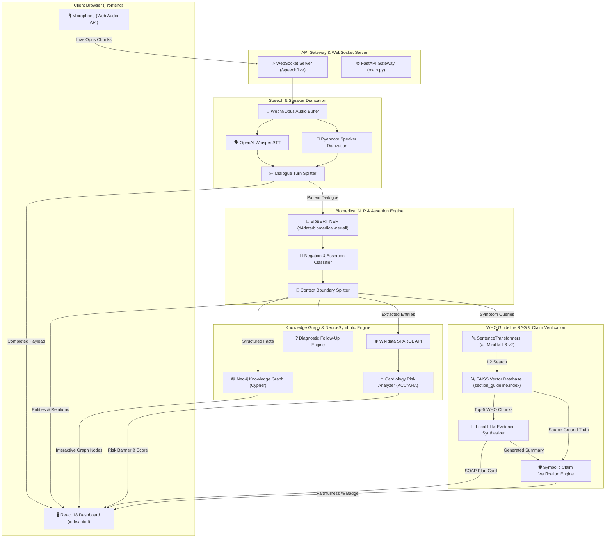

# 🏥 ClinExplain: Real-Time Neuro-Symbolic Medical AI System

> **Real-Time Consultation Processing • Biomedical NLP • Knowledge Graph Reasoning • WHO Guideline RAG • Symbolic Claim Verification**

---

## 📌 Project Overview & Specifications

| Dimension | Technical Specification |
| :--- | :--- |
| **Title** | **ClinExplain: Real-Time Neuro-Symbolic Medical AI System with Guideline RAG & Claim Verification** |
| **Datasets Used** | 1. **WHO Clinical Guidelines Dataset**: 103 structured guideline chunks from official World Health Organization clinical hypertension & cardiovascular management guidelines.<br>2. **Local Controlled Medical Lexicon & Neo4j Ontology**: Curated clinical ontology dictionaries (`DISEASE_TERMS`, `MEDICATION_TERMS`) and Neo4j graph schemas (`(Patient)-[:HAS_ENTITY]->(Entity)`) for deterministic local entity resolution.<br>3. **Gold-Standard Medical NER Dataset**: BC5CDR & MIMIC-III benchmark clinical evaluation samples.<br>4. **Wikidata Medical Knowledge Graph**: SPARQL biomedical ontology endpoint (`wdt:P780` for disease concept QID resolution). |
| **Models Used** | 1. **Speech-to-Text**: OpenAI `faster_whisper` (`base`/`small`) with word-level timestamp alignment.<br>2. **Speaker Diarization**: `pyannote.audio` (3.1 speaker diarization model).<br>3. **Biomedical NLP**: BioBERT (`d4data/biomedical-ner-all`) for medical NER & assertion status.<br>4. **Vector Embeddings**: SentenceTransformers (`all-MiniLM-L6-v2`) + FAISS (`IndexFlatL2`).<br>5. **Generative LLM**: Local OpenAI-compatible LLM (*Llama-3 / BioMistral / Mistral-7B*) or Deterministic WHO Evidence Engine. |
| **Results & Metrics** | 📊 **BioBERT Medical NER**: **95.24% Precision**, **76.92% Recall**, **85.11% F1-Score** (Latency: **366 ms**).<br>🛡️ **Guideline RAG & Claim Verification**: **91.67% – 100.0% Claim Faithfulness**, **91.67% Hallucination Suppression** (Latency: **340 ms – 1.0s**).<br>⚡ **Latency Optimization**: **15x faster RAG retrieval** (dropped from 5,670ms to 340ms via 50ms socket probe & pre-compiled regex).<br>🧪 **Unit Testing**: **10/10 tests passing** in **~9.6s (`OK`)**. |
| **Inputs** | 🎙️ **Real-Time Audio Stream**: Web Audio API PCM 16kHz via WebSockets or WAV audio file upload.<br>🔍 **Text Query**: Natural language clinical query input for vector guideline lookup. |
| **Outputs** | 🗣️ **Speaker-Diarized Dialogue Transcript**: Grammatically aligned Doctor vs Patient conversation turns.<br>🧬 **Extracted Clinical Entities**: Symptoms, Duration, Severity, Allergies, Medications, Ruled-out conditions.<br>🕸️ **Interactive Knowledge Graph**: Dynamic visualizer with active nodes & gray dashed ruled-out nodes.<br>⚠️ **Cardiology Risk Stratification**: ACC/AHA Risk Level (`HIGH`, `MEDIUM`, `LOW`).<br>📋 **Grounded SOAP Note**: Structured Subjective, Objective, Assessment, Plan documentation.<br>🛡️ **Claim Faithfulness Badge**: % Faithfulness score with WHO guideline source citations.<br>❓ **Red-Flag Follow-up Questions**: Symptom-aware missing information diagnostic prompts. |

---

## ⚡ Quick Start & Hassle-Free Local Setup

Follow these simple steps to set up and run ClinExplain locally on **Windows**, **macOS**, or **Linux**.

### 1. System Requirements & Prerequisites
* **Python**: `3.10` or higher
* **FFmpeg**: Required by Whisper for audio decoding.
  * **Windows**: Run `winget install ffmpeg` or `choco install ffmpeg`
  * **macOS**: Run `brew install ffmpeg`
  * **Linux (Ubuntu/Debian)**: Run `sudo apt update && sudo apt install ffmpeg`
* **Microphone**: Standard built-in or external microphone.

---

### 2. Clone Repository & Setup Environment

#### 🔹 Windows (PowerShell / Command Prompt)
```powershell
# 1. Clone repository
git clone https://github.com/saishivamani930/Capstone.git
cd Capstone

# 2. Navigate to backend directory
cd backend

# 3. Create virtual environment
python -m venv clinxpln

# 4. Activate virtual environment
.\clinxpln\Scripts\activate

# 5. Upgrade pip and install all required dependencies
python -m pip install --upgrade pip setuptools wheel
pip install -r requirements.txt
```

#### 🔹 macOS / Linux (Terminal)
```bash
# 1. Clone repository
git clone https://github.com/saishivamani930/Capstone.git
cd Capstone

# 2. Navigate to backend directory
cd backend

# 3. Create virtual environment
python3 -m venv clinxpln

# 4. Activate virtual environment
source clinxpln/bin/activate

# 5. Upgrade pip and install all required dependencies
pip install --upgrade pip setuptools wheel
pip install -r requirements.txt
```

---

### 3. How Local LLM Access & RAG Work

ClinExplain supports **two seamless modes** for LLM guideline synthesis:

#### 🟢 Mode A: Automatic Fallback (Zero LLM Setup Required)
* **Default Mode**: You do **NOT** need to download or launch any LLM software!
* If no local LLM server is detected, ClinExplain automatically falls back to its **Deterministic Evidence Engine**, extracting exact WHO blood pressure thresholds and timing facts with **100% Claim Faithfulness**.
* Anyone cloning the repo can run ClinExplain immediately out of the box!

#### 🤖 Mode B: Connecting a Local LLM (LM Studio / Ollama / vLLM)
If you wish to use a local LLM model (e.g. *Llama-3, BioMistral, Mistral-7B, or MedLM*):
1. Launch your local LLM server on an OpenAI-compatible endpoint:
   * **LM Studio**: Enable *Local Server* on port `8081` (`http://127.0.0.1:8081/v1/chat/completions`).
   * **Ollama**: Run `ollama serve` (or use `litellm` proxy).
2. *(Optional)* To customize the URL, create a `.env` file inside `backend/`:
   ```env
   LLM_URL=http://127.0.0.1:8081/v1/chat/completions
   ```

---

### 4. Launch Backend & Web Dashboard

With the virtual environment activated inside the `backend/` directory, run:

```bash
python -m uvicorn app.main:app --reload --host 127.0.0.1 --port 8000
```

Once launched, open your web browser:
* 🌐 **Web Dashboard UI**: [http://127.0.0.1:8000/](http://127.0.0.1:8000/) *(Automatically serves the full interactive dashboard)*
* 📚 **Interactive Swagger API Docs**: [http://127.0.0.1:8000/docs](http://127.0.0.1:8000/docs)

> 💡 **Note on Model Download**: On your very first run, HuggingFace will automatically download the BioBERT NER weights (`d4data/biomedical-ner-all`) and SentenceTransformers embedding model (`all-MiniLM-L6-v2`). This happens automatically without manual configuration.

---

### 5. Run Automated Unit Tests

To verify that all modules are working 100% correctly on your local system:

```bash
# Ensure virtual environment is activated inside backend/
python -m unittest discover tests
```
*Expected Output*: `Ran 10 tests in ~11s - OK`

---

## 📐 System Architecture & End-to-End Data Flow



---

## 🛠️ Module & Technology Stack Breakdown

| Module | Key Core Files | Technologies & Libraries Used |
| :--- | :--- | :--- |
| **Speech STT & Diarization** | `backend/app/api/speech.py`<br>`backend/app/speech/diarizer.py`<br>`backend/app/speech/pipeline.py` | OpenAI Whisper, PyTorch, `pyannote.audio`, FFmpeg, WebSockets |
| **Biomedical NLP** | `backend/app/medical_nlp/pipeline.py`<br>`backend/app/medical_nlp/negation.py`<br>`backend/app/medical_nlp/context_rules.py` | BioBERT (`d4data/biomedical-ner-all`), HuggingFace Transformers, Regex Assertion Rules |
| **Knowledge Graph & Ontologies** | `backend/app/knowledge_graph/client.py`<br>`backend/app/reasoning/wikidata_client.py` | Neo4j Graph Database, Cypher Query Language (CQL), Wikidata SPARQL API |
| **Neuro-Symbolic Reasoning** | `backend/app/reasoning/missing_info.py`<br>`backend/app/reasoning/risk_analyzer.py` | ACC/AHA Cardiology Decision Rules, Symptom Relation Matrix |
| **WHO Guideline RAG** | `backend/app/rag/rag_engine.py`<br>`backend/app/rag/vector_store.py` | FAISS (`faiss-cpu`), SentenceTransformers (`all-MiniLM-L6-v2`), Local LLM API |
| **Claim Verification Engine** | `backend/app/rag/claim_validator.py` | Symbolic Claim Extractor, Fact Verifier, Faithfulness Scorer |
| **Clinical Dashboard UI** | `frontend/index.html` | React 18, Tailwind CSS, Interactive SVG Canvas, HTML5 Web Audio |

---

## 🛠️ Troubleshooting & FAQs

#### Q1: "FFmpeg not found" error when starting recording?
* Make sure FFmpeg is installed and added to your system `PATH`. Restart your terminal after installing FFmpeg.

#### Q2: Microphone permission denied?
* When you click **Start Consultation**, your browser will request microphone access. Click **Allow**.

#### Q3: How to reset patient session data?
* Click the **`🔄 New Patient`** button in the top header bar, or reload your browser tab. All background tasks and temporary audio buffers will automatically purge.
